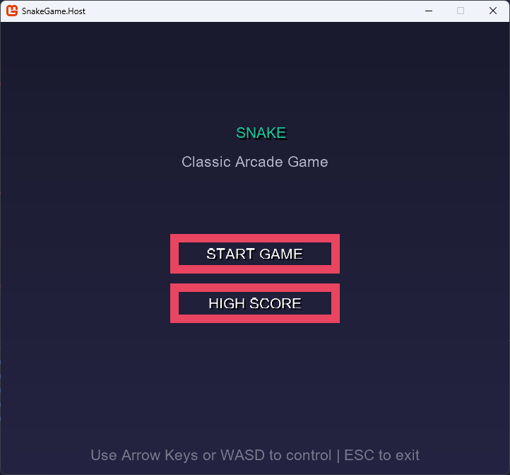
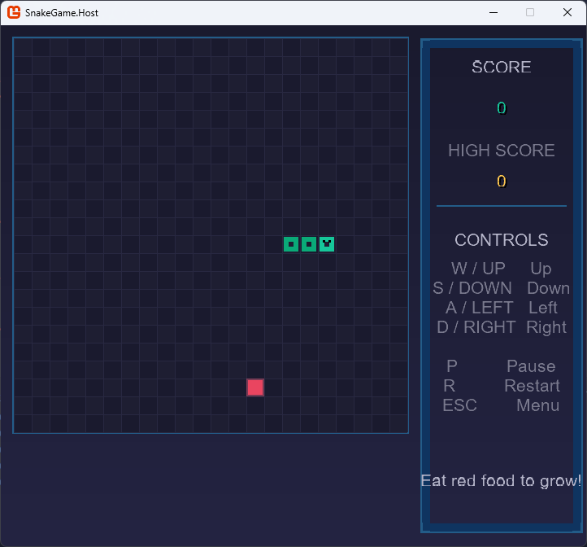
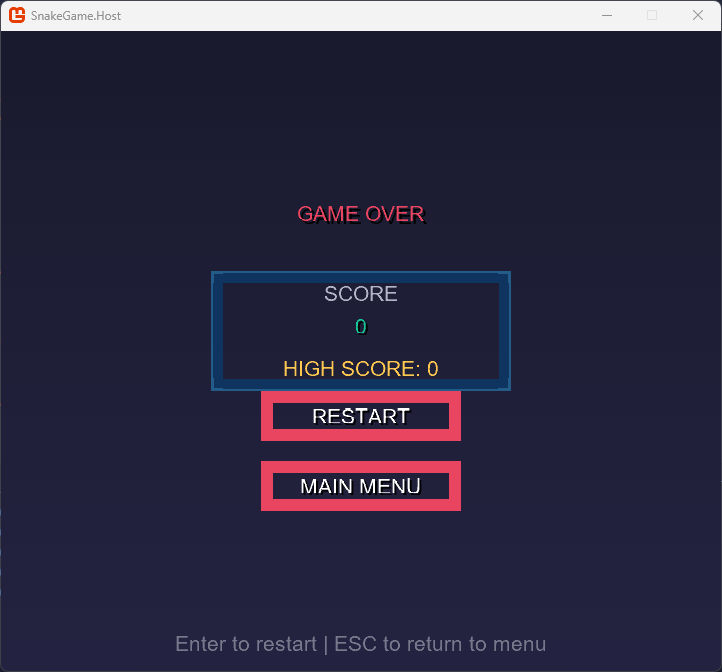

# Snake Game

基于 MonoGame 框架开发的贪吃蛇游戏，采用 C# 和 slnx 多项目结构。

## 技术栈

- **C# / .NET 9.0**
- **MonoGame 3.8.5**
- **ContentBuilder API**（新内容构建系统）

## 项目预览

| 开始场景 | 游戏场景 | 结束场景 |
|:--------:|:--------:|:--------:|
|  |  |  |

## 项目结构

```
Test_MonoGame/
├── SnakeGame.Core/          # 核心游戏逻辑（蛇、食物、网格、引擎）
├── SnakeGame.Host/          # 宿主项目（渲染、输入、场景管理）
├── SnakeGame.Content/       # 内容资源项目（字体、图片等）
└── SnakeGame.slnx           # 解决方案文件
```

### SnakeGame.Core

游戏核心逻辑，与渲染无关：

| 文件 | 职责 |
|------|------|
| `Direction.cs` | 方向枚举（Up, Down, Left, Right） |
| `Position.cs` | 位置结构体 |
| `GameState.cs` | 游戏状态枚举（Playing, Paused, GameOver） |
| `Snake.cs` | 蛇对象，移动、生长、碰撞检测 |
| `Food.cs` | 食物对象 |
| `Grid.cs` | 网格管理，边界检测 |
| `GameEngine.cs` | 游戏引擎，协调各组件 |

### SnakeGame.Host

MonoGame 宿主项目，负责渲染和场景管理：

| 文件 | 职责 |
|------|------|
| `SnakeGame.cs` | 主游戏类，管理场景切换 |
| `Scene.cs` | 场景基类 |
| `StartScene.cs` | 开始界面 |
| `GameScene.cs` | 游戏界面 |
| `GameOverScene.cs` | 结束界面 |
| `ColorPalette.cs` | 统一颜色主题 |
| `UiHelper.cs` | UI 绘制辅助工具 |

### SnakeGame.Content

内容资源项目，使用 MonoGame 3.8.5 的 ContentBuilder API：

| 文件 | 职责 |
|------|------|
| `Builder/Builder.cs` | 定义资源处理规则 |
| `Assets/Font/Arial.spritefont` | 字体资源 |

## 快速开始

### 环境要求

- .NET 9.0 SDK
- Windows 10/11（DesktopGL）

### 构建运行

```bash
dotnet run --project SnakeGame.Host
```

首次构建会自动处理 Content 资源，将字体文件编译为 XNB 格式。

## 游戏特性

- 多场景系统（开始、游戏、结束）
- 键盘控制（方向键 / WASD）
- 暂停功能（空格键）
- 得分系统 + 最高分记录
- 现代深色主题 UI
- 高 DPI 显示器支持

## 内容系统

本项目使用 MonoGame 3.8.5 引入的 **ContentBuilder API**，替代传统的 mgcb 方式。

### 添加新资源

1. 将资源文件放入 `SnakeGame.Content/Assets/` 对应目录
2. 在 `Builder/Builder.cs` 中添加规则：

```csharp
contentCollection.Include<WildcardRule>("Textures/*.png");
contentCollection.Include<WildcardRule>("Effects/*.fx");
contentCollection.Include<WildcardRule>("Sounds/*.ogg", 
    new OggImporter(), new SoundEffectProcessor());
```

3. 在代码中加载：

```csharp
Texture2D texture = Content.Load<Texture2D>("Textures/snake");
```

### 工作流程

```
编译 SnakeGame.Content 项目 → 生成 SnakeGame.Content.exe
       ↓
运行 SnakeGame.Content.exe 处理资源
       ↓
资源输出到 SnakeGame.Host/bin/Debug/net9.0/Content/
       ↓
Host 项目编译时自动包含资源
```

## 控制说明

| 按键 | 功能 |
|------|------|
| ↑ ↓ ← → / W A S D | 控制蛇的移动 |
| 空格 | 暂停 / 继续 |
| Enter | 确认 / 开始游戏 |
| Esc | 返回主菜单 |

## 许可证

MIT License
